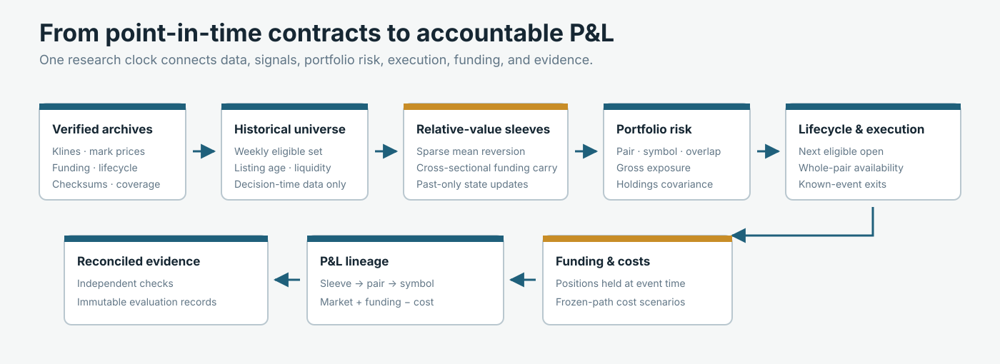
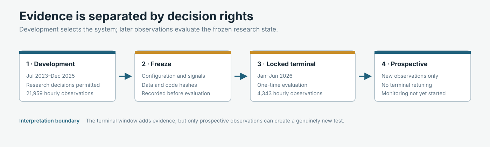
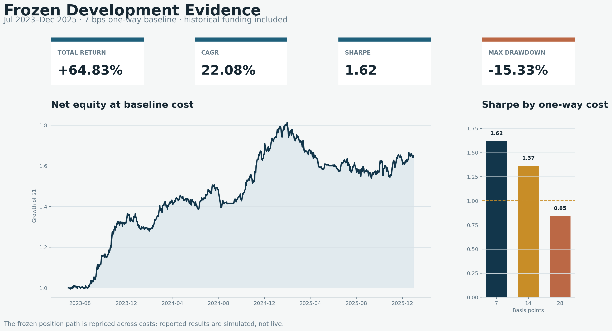
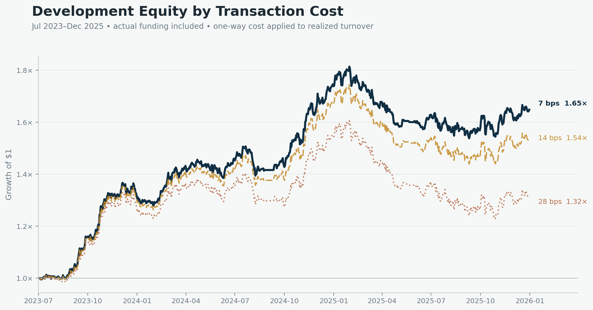
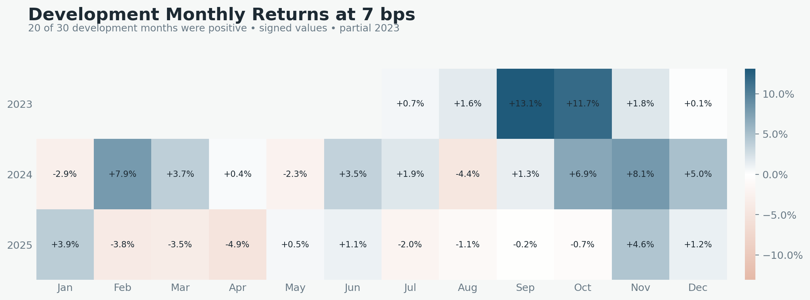
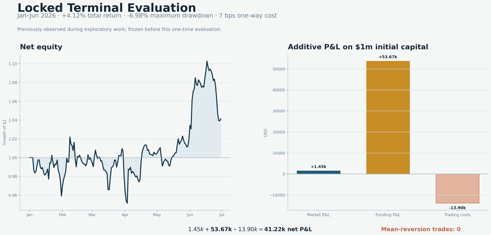

# Crypto Perpetual Relative-Value Research

[](https://github.com/Jing-Lavinia/crypto-relative-value-research/actions/workflows/tests.yml)

**Can crypto relative value survive the market mechanics that simple
backtests omit?**

This repository documents a point-in-time research system for Binance USD-M
perpetual futures. It connects verified historical archives, a changing
contract universe, relationship and funding signals, portfolio risk, next-open
two-leg execution, contract lifecycle controls, and accountable P&L.

The frozen development portfolio returned **64.83%** in total, equivalent to a
**22.08% CAGR** and **1.62 Sharpe** at 7 bps one-way cost plus historical
realized funding, with a **-15.33% maximum drawdown**. A separate six-month
locked terminal evaluation returned **+4.12%**.

Terminal attribution narrowed the conclusion. Funding generated most of the
positive P&L, while the sparse mean-reversion sleeve placed no trades. The
portfolio remains worth monitoring, but the two sleeves require separate
prospective evidence.



| Development return | CAGR | Sharpe | Maximum drawdown | Terminal return |
|---:|---:|---:|---:|---:|
| +64.83% | 22.08% | 1.62 | -15.33% | +4.12% |

*Simulated research results. Development figures use 7 bps one-way cost plus
historical realized funding; terminal return covers January–June 2026.*

## The problem

A perpetual-futures relative-value result depends on more than the signal. The
tradable contract set changes, funding transfers cash between long and short
positions, delistings interrupt position lifecycles, and a pair cannot always
execute both legs at the same timestamp. Shared symbols also create an
accounting problem when several pairs are aggregated into one portfolio.

The research question is therefore tested at system level: form each decision
from information available at that time, preserve pair identity through
execution, apply funding and costs to the positions actually held, and
reconcile every result from contract leg to portfolio.

| Common backtest shortcut | Resulting distortion | System control |
|---|---|---|
| Use today's contract list throughout history | Survivorship and delisting bias | Weekly point-in-time eligibility and lifecycle records |
| Trade at the signal timestamp | Look-ahead in execution | Close-`t` decision, next-open execution |
| Fill pair legs independently | Accidental directional exposure | Whole-pair execution availability |
| Ignore or approximate funding | Misstated perpetual-futures economics | Historical funding events applied to held positions |
| Sum pair P&L directly | Shared-symbol duplication or mismatch | Pair → symbol → portfolio reconciliation |
| Size from isolated pair risk | Hidden portfolio concentration | Current-holdings covariance scaling and exposure caps |

## System overview

The frozen research state was built from:

- 26,051 official Binance historical objects checked against local and
  published SHA-256 values;
- 11,496,302 hourly market rows with no duplicate keys, invalid OHLC rows, or
  null fields in the accepted kline set;
- 157 weekly point-in-time universe refits, with 20 eligible contracts per
  refit and 150 contracts in the historical union;
- 3,140 active contract-weeks passing kline, mark-price, and funding coverage
  checks;
- 40 automated checks in the private empirical implementation, covering
  timing, lifecycle, execution, exposure, accounting, metrics, and immutable
  evaluation records.

The 26,051-object manifest joins three economically different data families:

| Historical source | Verified objects | Research role |
|---|---:|---|
| Hourly klines | 16,078 monthly archives | Universe liquidity, execution prices, market P&L |
| Hourly mark prices | 5,057 monthly + 40 daily archives | Intrahour adverse marks and liquidation-buffer checks |
| Funding rates | 4,876 monthly archives | Event-time funding cash flows and carry ranking |
| **Combined manifest** | **26,051** | Object key, published checksum, local checksum, size, processing record |

Across the 3,140 accepted active contract-weeks, minimum kline/mark join
coverage was 100% and the maximum observed gap between funding records was
eight hours. Rare zero-volume hours remain in the data and are handled by the
execution engine instead of being silently removed.

```text
verified historical archives
  → point-in-time eligible universe
  → mean-reversion and funding-carry sleeves
  → portfolio and covariance risk controls
  → lifecycle-aware next-open execution
  → historical realized funding and trading costs
  → sleeve / pair / symbol / portfolio attribution
  → reconciliation and immutable evidence
```

## Research and portfolio design

The portfolio combines two economically different sleeves inside the same
risk and execution engine.

- **Sparse mean reversion.** Past-only relationship discovery uses PCA
  representation, DBSCAN grouping, Engle–Granger testing, false-discovery-rate
  control, stability and half-life screens, and a past-only Kalman hedge state.
  Feature definitions, lags, thresholds, and acceptance rules remain private.
- **Cross-sectional funding carry.** Contracts are ranked using funding
  information known at the decision time. The sleeve forms relative long/short
  positions between lower- and higher-funding contracts. Ranking horizon,
  spread filters, and sizing parameters remain private; the sleeve is not
  described as risk-free funding arbitrage.

The portfolio applies pair, symbol, overlap, and total-gross constraints before
position-aware Ledoit–Wolf covariance scaling. The covariance estimate uses
past returns and current holdings; its lookback, target, and sizing parameters
remain private.

### Research decisions retained in the frozen system

Several economically distinct alternatives were evaluated against the same
timing, turnover, cost, and portfolio controls. The frozen system retains only
the components supported by that review.

| Research branch | System-level evidence | Frozen decision |
|---|---|---|
| Broader relationship sets | More candidates increased deployment but mainly added turnover and noise | Retain sparse, FDR-controlled mean reversion |
| Cross-sectional price momentum | Gross market and funding P&L did not survive turnover costs | Exclude from the frozen portfolio |
| Cross-sectional funding carry | Produced the strongest valid standalone opportunity set | Retain as the active second sleeve |
| Combined sleeves | Mean reversion diversified parts of the development path inside the shared risk engine | Freeze the combined development candidate |
| Lower risk targeting | Removed profitable deployments without sufficiently improving the worst drawdown | Not retained; further tuning stopped |

## Execution and accounting

A state update formed at close `t` can first alter holdings at the next
eligible open. If either leg lacks executable volume, the whole pair carries
its prior position rather than creating an unintended one-leg exposure.
Lifecycle exits use only announcements known by the decision time, and funding
is applied only to positions held at the funding event.

```text
research sleeve → pair → contract leg → aggregated symbol → portfolio
```

Market P&L, funding P&L, trading cost, and net P&L remain separate throughout
the ledger. A symbol shared by several pairs is aggregated exactly once.
Pair-, symbol-, and portfolio-level totals must reconcile within numerical
tolerance before an experiment can be promoted. Performance metrics are also
recomputed through an independent SQL path.

The executable [synthetic example](examples/synthetic_end_to_end.py) implements
a selected subset of these controls without exposing the private signal model
or empirical data.

## Evidence protocol



| Evidence layer | Hours | Permitted use | Interpretation |
|---|---:|---|---|
| Development | 21,959 | Research selection and frozen-path cost repricing | Main body of simulated evidence |
| Locked terminal | 4,343 | One-time evaluation; no subsequent parameter change | Additional evidence, but not a pristine holdout |
| Prospective | Not started | Predeclared monitoring only | Required for genuinely new evidence |

## Development evidence



| One-way cost plus historical realized funding | Total return | CAGR | Sharpe | Maximum drawdown |
|---|---:|---:|---:|---:|
| 7 bps | +64.83% | 22.08% | 1.62 | -15.33% |
| 14 bps | +53.86% | 18.77% | 1.37 | -17.67% |
| 28 bps | +31.93% | 11.70% | 0.85 | -23.62% |

### Cost sensitivity through time



The cost scenarios reprice the same frozen position path. They do not rerun
pair selection or sizing. Higher friction reduces both terminal wealth and the
ability to recover from the 2025 drawdown.

### Time consistency



The result was not uniform across time. Twenty of 30 calendar months and six of
ten calendar quarters were profitable, but 2025 returned -5.27% after partial
2023 returned +31.73% and 2024 returned +32.08%.

### Robustness summary

| Check | Frozen result | What it tests |
|---|---|---|
| Remove best development day | 20.31% CAGR, 1.55 Sharpe | Dependence on one observation |
| Remove best three days | 17.80% CAGR, 1.40 Sharpe | Dependence on a small number of strong observations |
| Positive rolling 90-day windows | 66.47% | Persistence across overlapping regimes |
| Moving-block bootstrap | 2,000 samples, five-day blocks; 99.45% cumulatively positive | Dependence-aware resampling |
| Bootstrap 95% intervals | CAGR 4.22%–41.80%; Sharpe 0.39–2.81 | Statistical uncertainty |
| Approximate 18-trial deflated Sharpe | 82.65% | Multiple-research-trial adjustment |
| Maximum profitable-pair concentration | 2.36% | Reliance on one winning pair |
| Frozen-path one-way cost break-even | Approximately 48.38 bps | Friction tolerance without changing holdings |

Profitable-pair concentration is the largest positive pair P&L divided by total
positive pair P&L. The bootstrap and deflated-Sharpe checks reduce neither the
development status of the sample nor the need for prospective evidence.

Bootstrap definitions, yearly evidence, and the complete interpretation
boundary are recorded in
[Evidence and robustness](docs/evidence-and-robustness.md).

## Locked terminal evaluation



| One-way cost plus historical realized funding | Six-month return | Sharpe | Maximum drawdown |
|---|---:|---:|---:|
| 7 bps | +4.12% | 0.65 | -6.98% |
| 14 bps | +2.73% | 0.46 | -7.36% |
| 28 bps | -0.047% | 0.06 | -8.13% |

On $1 million initial capital, the 7 bps ledger attributes approximately
+$1.45k to market movement, +$53.67k to funding, and -$13.90k to trading costs,
for +$41.22k net P&L. No mean-reversion pair traded in this window.

Four of six terminal months were positive. Q1 returned -2.08%, Q2 returned
+6.34%, and 74.67% of rolling 90-day windows were positive. At 28 bps, the
six-month path missed break-even by approximately $467 per $1 million initial
capital.

The portfolio remained positive at 7 and 14 bps, but the terminal result did
not independently validate the inactive mean-reversion sleeve. The window had
been observed during earlier exploratory work, so it is described as a
**locked terminal evaluation**, not a pristine holdout. No parameters were
changed after it was evaluated.

## Public implementation

The public package implements a selected set of core controls using synthetic
inputs: point-in-time eligibility, next-open timing, announcement-aware exits,
pair and exposure caps, whole-pair execution availability, funding and cost
accounting, reconciliation, and audit hashing. The example deliberately
triggers both a known lifecycle exit and a blocked two-leg rebalance.

It does not contain the private signal models, empirical thresholds,
Ledoit–Wolf estimator, margin and liquidation engine, raw market data, complete
promotion pipeline, or the implementation that generated the reported
results.

| System layer | Public executable boundary | Retained privately |
|---|---|---|
| Information and universe | Past-only observations, listing age, completeness, ranked eligibility | Archive ingestion, full manifests, full empirical tables |
| Signals | Replaceable deterministic target interface | Features, lags, thresholds, acceptance rules, empirical signal state |
| Portfolio | Pair, symbol, overlap, and total-gross caps | Ledoit–Wolf estimation, margin and liquidation controls, sizing parameters |
| Execution | Strict next-open timing and whole-pair availability | Full hourly market path and empirical execution records |
| Accounting | Leg ledger, funding, turnover cost, symbol aggregation, reconciliation | Complete empirical ledgers and independent SQL database |
| Audit | Deterministic hashes and immutable-write primitive | Run promotion, terminal lock, full configuration and artifact registry |

```bash
python -m pip install -e ".[dev]"
python examples/synthetic_end_to_end.py
pytest
```

```text
src/perpetual_rv_demo/
  universe.py            point-in-time contract eligibility
  signal_interfaces.py   replaceable synthetic target interface
  information_clock.py   decision-to-execution timing
  lifecycle.py           known-event exits
  portfolio.py           pair, symbol, and gross constraints
  execution.py           whole-pair execution availability
  accounting.py          funding, cost, and P&L reconciliation
  audit.py               deterministic hashes and immutable record primitive
  pipeline.py            synthetic end-to-end orchestration
```

The example output makes the exercised failure paths visible:

```json
{
  "lifecycle_flattened_pairs": ["mr:AAA-BBB"],
  "blocked_pairs": ["carry:CCC-DDD"],
  "reconciliation_passed": true,
  "audit_payload_sha256": "43a5c43d..."
}
```

The public tests cover this selected control boundary. The private empirical
implementation's 40-test result is reported separately and is not implied by
the public test suite.

## Limitations and next questions

- The terminal window is locked but not a pristine holdout.
- Terminal profit was concentrated in funding, making the result sensitive to
  funding regimes and transaction costs.
- The mean-reversion sleeve had no terminal trades and still requires separate
  prospective evidence.
- Historical bars and linear cost scenarios cannot reproduce queue position,
  exchange outages, market impact, or production capacity.

The next research step is prospective, sleeve-specific monitoring: determine
whether funding carry persists across new regimes, wait for independent
mean-reversion opportunities, and measure how tighter execution and capacity
assumptions change both sleeves.

Detailed definitions and evidence are in [System design](docs/system-design.md),
[Evidence and robustness](docs/evidence-and-robustness.md),
[Terminal evaluation](docs/terminal-evaluation.md), and
[Limitations and boundaries](docs/limitations-and-boundaries.md).

> Simulated research evidence only. This repository is not investment advice
> and does not report live trading performance.
